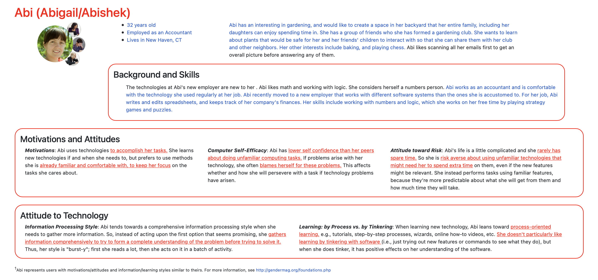

# Project 2: Design Journey

**For each milestone, complete only the sections that are labeled with that milestone.** Refine all sections before the final submission. If you later need to update your plan, **do not delete the original plan, leave it place and append your new plan below the original.** Explain why you are changing your plan. Remember you are graded on your design process. Updating the plan documents your process!

**Replace ALL _TODOs_ with your work.** (There should be no TODOs in the final submission.)

Be clear and concise in your writing. Bullets points are encouraged.

**Everything, including images, must be visible in Markdown Preview.** If it's not visible in Markdown Preview, then we won't grade it. We won't give you partial credit either. **Your design journey should be easy to read for the grader; in Markdown Preview the question _and_ answer should have a blank line between them.**


## Design / Plan (Milestone 1)

**Make the case for your decisions using concepts from class, as well as other design principles, theories, examples, and cases from outside of class (includes the design prerequisite for this course).**

You can use bullet points and lists, or full paragraphs, or a combo, whichever is appropriate. The writing should be solid draft quality.

### Audiences (Milestone 1)
> Who are your site's audiences?
> Briefly explain who the intended audiences are for your project website.
> **DO NOT INVENT RANDOM AUDIENCES HERE!** Use the audiences from the requirements.

_Consumer_: Parents with developing children

_Site Administrator_: Members of the Playful Plants project


### _Consumer_ Audience Goals (Milestone 1)
> Document your audience's goals.
> List each goal below. There is no specific number of goals required for this, but you need enough to do the job.
> **DO NOT INVENT RANDOM GOALS HERE OR STEREOTYPE HERE!** Your goals are things that your users want accomplish when using the site (e.g. print a list of plants). These are informed by the Playful Plants objectives. Review the assignment's requirements for details.

_Consumer_ Goal 1: Access information about plants that encourage development in their children.

- **Design Ideas and Choices** _How will you meet those goals in your design?_
  - Database containing plant information.
  - Multiple tables in database.
  - Page with information for each plant.
- **Rationale & Additional Notes** _Justify your decisions; additional notes._
  - In addition to the basic details about the plants, each table will include additional information related to each plant, etc. that the user might seek out. Each tile for a plant would provide more info for users as well on another page.

_Consumer_ Goal 2: Narrow down information to find a specific plant/kind of plant and share it.

- **Design Ideas and Choices** _How will you meet those goals in your design?_
  - Sort and filter features.
  - Print query/styling
- **Rationale & Additional Notes** _Justify your decisions; additional notes._
  - Sorting and filtering can help the users look through a less overwhelming amount of data if a database has a high number of records, and allows users to find results more easily. User will be able to print out the search results they find and want to share.

_Consumer_ Goal 3: Access and easily use a site from a mobile device.

- **Design Ideas and Choices** _How will you meet those goals in your design?_
  - Mobile styling in addition to desktop styling.
  - Employing common design patterns for mobile sites.
- **Rationale & Additional Notes** _Justify your decisions; additional notes._
  - Since mobile sites need to have a different layout than desktops to accomodate for a smaller screen size, a more recognizable and common design would make a mobile site more comfortable to use.


### _Consumer_ Persona (Milestone 1)
> Use the goals you identified above to develop a persona of your site's audience.
> Create your persona using GenderMag's customizable personas.
> Take a screenshot and include it here. Persona must be visible in Markdown Preview; do not use PDF format!



### _Administrator_ Audience Goals (Milestone 1)
> Document your audience's goals.
> List each goal below. There is no specific number of goals required for this, but you need enough to do the job.
> **DO NOT INVENT RANDOM GOALS HERE OR STEREOTYPE HERE!** Your goals are things that your users want accomplish when using the site (e.g. print a list of plants). These are informed by the Playful Plants objectives. Review the assignment's requirements for details.

_Administrator_ Goal 1: Create a searchable database of plants that support nature play experiences.

- **Design Ideas and Choices** _How will you meet those goals in your design?_
  - Database that is populated with different playful plants
  - Sorting and filters
- **Rationale & Additional Notes** _Justify your decisions; additional notes._
  - Compiling a database with information about plants that fit this criteria and making it easily searchable using sorting and filtering features is a good way to inform people who are interested in taking on such gardening projects.

_Administrator_ Goal 2: Insert new entries, edit existing entries, and delete entries into a database of plants.

- **Design Ideas and Choices** _How will you meet those goals in your design?_
  - Form for adding a new plant
  - Option to add and delete plants
- **Rationale & Additional Notes** _Justify your decisions; additional notes._
  - Data on the site should be up-to-date and as accurate as possible, so being able to remove or add plants is important for keeping the information credible.

_Administrator_ Goal 3: Allow only project administrators to make changes to the site.

- **Design Ideas and Choices** _How will you meet those goals in your design?_
  - Login feature to allow only administrators to perform this tasks
  - Logotut feature
- **Rationale & Additional Notes** _Justify your decisions; additional notes._
  - The ability to log in and log out can prevent nonmembers of Playful Plants from having access to the features on the site that are used to make changes to it.


### _Administrator_ Persona (Milestone 1)
> Use the goals you identified above to develop a persona of your site's audience.
> Create your persona using GenderMag's customizable personas.
> Take a screenshot and include it here. Persona must be visible in Markdown Preview; do not use PDF format!


### Site Design (Milestone 1)
> Document your _entire_ design process. **We want to see iteration!**
> **Show us the evolution of your design from your first idea (sketch) to the final design you plan to implement (sketch).**
> **Show us how you decided what data to display to each audience.**
> **Plan your URLs for the site.**
> **Provide a brief explanation _underneath_ each design artifact (2-3 sentences).** Explain what the artifact is, how it meets the goals of your personas (**refer to your personas by name**).
>
> **Important!** Plan _all_ site requirements. Don't forget login and logout.

_Initial Designs / Design Iterations:_

This is the first iteration of the catalog page for consumers. It shows as many results as possible for Abi and Pat, who like reading through everything and collecting as much information as possible first.


The second iteration shows fewer results per row, but still many results at once, but it is easier to read with reduced clutter.


The mobile version keeps the sorting and filtering at the top of the page so that Abi and Pat do not have to find its new location. The content is organized vertically so that they aren't cluttered on a small screen.


The first iteration of the admin version of the site. This version has more clear separation of each catalog entry and descriptive buttons for someone like Abi or Pat who doesn't want to tinker with the buttons too much.


The second iteration of the admin version of the site. This version has separation of each catalog entry using spaces to make it less visually confusing and still has the descriptive buttons instead of icons for a user who doesn't want to tinker with the buttons.


_Final Design:_

The final iteration shows fewer results per row, but still many results at once for Abi and Pat, who like reading through everything and collecting as much information as possible first., but it is easier to read with reduced clutter.

NOTE: I moved the sort feature to the left next to the filters since they are going to be in one form together.


The mobile version keeps the sorting and filtering at the top of the page so that Abi and Pat do not have to find its new location. The content is organized vertically so that they aren't cluttered on a small screen.


The final iteration of the admin version of the site. This version has more clear separation of each catalog entry and descriptive buttons for someone like Abi or Pat who doesn't want to tinker with the buttons too much.


The sign in form has feedback and clear labels so that people, such as Abi and Pat, who tend to have low to medium self efficacy, don't get discouraged. The data insertion form also has clear labels and feedback for invalid entries.


The edit form has the same labels and feedback as the insertion form in case a user accidentally leaves a field blank or submits invalid data.

NOTE: I removed the upload image button from the data insertion form since images and media cannot be inserted into the database


This is the design for each page that contains extra information on the plants when a plant's thumbnail is clicked. There is a button at the top corner to return to the main catalog.

NOTE: I removed the upload image button from the data insertion form since images and media cannot be inserted into the database


This is the design for a page that opens when Abi or Pat click on the tags in the sidebar to get more information on a Play Type. The sidebar remains in case they want to look at a different category. (not drawn but there should also be a button to return to the main catalog.)


### Design Pattern Explanation/Reflection (Milestone 1)
> Write a one paragraph (6-8 sentences) reflection explaining how you used design patterns for media catalogs in your site's final design.

I used design patterns in my catalog through the layout of the different parts of it, such as the filters and sorting. The filters are located in a sidebar on the left with commonly-used checkboxes, and the sorting feature is located at the top with radio buttons. The catalog items are also presented as suare thumbnails with brief labels, which is a common way that catalog items are presented on catalog sites. To access more information about the items, clicking the thumbnail will take users to a page that has the infromation that could not be added to the small space below the thumbnail. My forms also use common design patterns, such as placing the text fields below their respective titles and adding feedback below each text field. The button for submitting all of these forms is also aligned to the right, while everything else is aligned to the left to be followed better by a user's eye.


### Cognitive Styles Explanation/Reflection (Milestone 1)
> Write a one paragraph (6-8 sentences) reflection explaining how your final design supports the cognitive styles of each persona.

_Consumer Cognitive Styles Reflection:_

Abi tends to learn new technology to accomplish task, which is why the design of the site is something she would already be familar with and comfortable using. She processes information that is more comprehensive, which is why my site aims to present as much information as possible on any given part of the page. Abi has low computer self-efficacy, which is why my site offers clearer instructions and feedback when necessary to avoid any discouragement or confusion. She tends to also be risk-averse, which is why everything is labeled clearly so she knows what she is clicking on before clicking it. Lastly, she learns by process, so there is little need to tinker since many common design patterns are in use.


_Site Administrator Cognitive Styles Reflection:_

Pat tends to learn new technology when she needs to, which is why the design of the site is something she would already be familar with and comfortable using, since using a website isn't necesarily always an occasion to learn new technology. She leans toward processing information more comprehensively, which is why my site aims to present as much information as possible on any given part of the page, but filters and sorting is also available to explore the options. Pat has medium computer self-efficacy, which is why the site offers feedback in certain places when necessary. She tends to be risk-averse, which is many features are labeled clearly so she knows what she is clicking on before clicking it. Lastly, the site has a feature for inserting new plants into the databse, which may require learning some new features or processes to complete, which Pat would see as a necessary learning moment so that she can use the site more easily in the future.


## Implementation Plan (Milestone 1, Milestone 2, Milestone 3, Final Submission)

### Database Schema (Milestone 1)
> Describe the structure of your database. You may use words or a picture. A bulleted list is probably the simplest way to do this. Make sure you include constraints for each field.
> **Hint: You probably need a table for "entries", `tags`, `"entry"_tags`** (stores relationship between entries and tags), and a `users` tables.
> **Hint: For foreign keys, use the singular name of the table + _id.** For example: `image_id` and `tag_id` for the `image_tags` (tags for each image) table.

plants (
id: INTEGER {AI, U, PK, NN},
plant_name: TEXT {NN},
genus_species: TEXT {NN, U},
plant_id: TEXT {NN, U},
constructive: INTEGER {NN},
physical: INTEGER {NN},
imaginative: INTEGER {NN},
restorative: INTEGER {NN},
expressive: INTEGER {NN},
rules: INTEGER {NN},
bio: INTEGER {NN},
classification_id: INTEGER {NN},
lifetime_id: INTEGER {NN},
range_id: INTEGER {NN},
)

users (
id: INTEGER {AI, U, PK, NN},
username: TEXT {U, NN},
pass_word: TEXT {NN}
)

classifications (
id: INTEGER {AI, U, PK, NN},
classification: TEXT {NN}
)

lifetimes (
id: INTEGER {AI, U, PK, NN},
life_time: TEXT {NN}
)

ranges (
id: INTEGER {AI, U, PK, NN},
hardiness: TEXT {NN}
)


### Database Query Plan (Milestone 1, Milestone 2, Milestone 3, Final Submission)
> Plan _all_ of your database queries. You may use natural language, pseudocode, or SQL.

```
Main Catalog:
SELECT * FROM plants;

Filter:
SELECT * FROM plants WHERE (__playtype___ = 0 or 1)

Sorting:
SELECT * FROM plants
ORDER BY name ASC;

SELECT * FROM plants
ORDER BY name DESC;

Insertion Form:
INSERT INTO plants (id, name, genus, species, plantid, constructive, physical, imaginative, restorative, expressive, rules, bio, entry_tags, user_id) VALUES (id, name, genus, species, plantid, constructive, physical, imaginative, restorative, expressive, rules, bio,entry_tags, user_id);

Delete record button:
DELETE FROM plants WHERE (id = ______);

Edit record:
UPDATE plants SET
  field1 = value1
  field2 = value2
  ...
  WHERE  (id = _____);
```
To access all info on all plants:
SELECT * FROM plants;

To access "more information page":
SELECT * FROM plants WHERE id = _____;
```
TODO: Plan another query
```

TODO: ...


### Code Planning (Milestone 1, Milestone 2, Milestone 3, Final Submission)
> Plan any PHP code you'll need here using pseudocode.
> Tip: Break this up by pages. It makes it easier to plan.

```
Show play types for each plant:
If (play type name = 0)
  echo "No"
If (play type name = 1)
  echo "Yes"

Edit record:
If edit entry button is clicked:
  Open insert record form
If form is valid:
  Resubmit form and update database

Delete record:
If delete entry button is clicked:
  Delete record from database

Insert entry:
If insert entry button is clicked:
  Show insertion form
If input is valid:
  Enter into database
  Show confirmation
If input is invalid:
  Show feedback messages
  Make valid fields sticky

Sign in:
If sign in button is clicked:
  Show sign-in form
If input is valid:
  Show admin page
  Display sign out button
If input is invalid:
  Show feedback messages
  Make valid fields sticky

Sign out:
If sign in button is clicked:
  End session
  Display sign in button

```
When user clicks on one plant on the catalog:
  Link attached to the thumbnail takes user to another page with more details

When user clicks on 'go back' button:
  Link takes user back to main catalog
```

```
TODO: WRITE MORE PSEUDOCODE HERE, between the back-tick lines.
```

TODO: ...


### Accessibility Audit (Final Submission)
> Tell us what issues you discovered during your accessibility audit.
> What do you do to improve the accessibility of your site?

TODO


## Reflection (Final Submission)

### Audience (Final Submission)
> Tell us how your final site meets the goals of your audiences. Be specific here. Tell us how you tailored your design, content, etc. to make your website usable for your personas.

TODO


### Additional Design Justifications (Final Submission)
> If you feel like you haven’t fully explained your design choices in the final submission, or you want to explain some functions in your site (e.g., if you feel like you make a special design choice which might not meet the final requirement), you can use the additional design justifications to justify your design choices. Remember, this is place for you to justify your design choices which you haven’t covered in the design journey. You don’t need to fill out this section if you think all design choices have been well explained in the design journey.

TODO


### Self-Reflection (Final Submission)
> Reflect on what you learned during this assignment. How have you improved from Project 2? What would you do differently next time?

TODO


> Take some time here to reflect on how much you've learned since you started this class. It's often easy to ignore our own progress. Take a moment and think about your accomplishments in this class. Hopefully you'll recognize that you've accomplished a lot and that you should be very proud of those accomplishments!

TODO


### Grading: Step-by-Step Instructions (Final Submission)
> Write step-by-step instructions for the graders.
> The project if very hard to grade if we don't understand how your site works.
> For example, you must login before you can delete.
> For each set of instructions, assume the grader is starting from /

_View all entries:_

1. TODO
2.

_View all entries for a tag:_

1. TODO
2.

_View a single entry's details:_

1. TODO
2.

_How to insert and upload a new entry:_

1. TODO
2.

_How to delete an entry:_

1. TODO
2.

_How to edit and existing entry and its tags:_

1. TODO
2.
